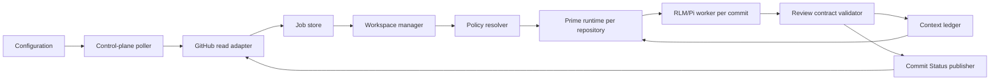

# Big Brother Core Architecture

## Design position

Big Brother is an independent Prime-derived agent with a deterministic control
plane around a long-lived Repository Prime runtime. The control plane owns
observation, job identity, repository materialization, policy input selection,
and GitHub publication. Repository Prime owns the durable repository
conversation and invokes an isolated Commit-review worker for each commit
review.

The control plane is not an LLM loop. Repository Prime is not the GitHub
poller, and a Commit-review worker is not the repository's final reviewer. This
separation is the central design seam: deterministic state transitions can be
tested without a model, while Prime retains the project-level reasoning that
benefits from a long-lived context.

For each repository, Repository Prime is the long-lived main agent. It admits
a bounded child worker for each immutable commit, receives the worker's
evidence-backed proposal, zooms out over the repository context, and produces
the final Review record. The worker cannot publish or update the Context
Ledger directly.

## Relationship to Prime and Sifu

The inspected Prime runtime provides the relevant long-running primitives:

- a package-driven agent identity and configuration directory;
- daemon-backed resident sessions and session persistence;
- a Python RLM runtime whose host owns child lifecycle and state;
- recursive child admission through `rlm.run` and result delivery through
  explicit messages or artifacts; and
- public print, JSON, RPC, and SDK integration modes.

The inspected Sifu construction demonstrates the independent-agent layer:

- a symlink-safe launcher resolves its own root;
- a renamed package drives the app name, config directory, and environment
  variable namespace;
- runtime, active resources, source snapshots, and state are kept separately;
  and
- child processes launch the renamed agent and propagate its namespace instead
  of falling back to Pi.

Big Brother adopts these patterns but uses a repository control plane instead
of Sifu's teaching workflow and interactive tmux-oriented subagent surface.

## Runtime layout

The target repository layout is:

```text
big-brother/
├── bin/big-brother                 # stable, symlink-safe launcher
├── runtime/                        # Prime-derived runtime, version-pinned
├── config-sources/prime-agent/     # upstream source snapshot and notes
├── packages/big-brother/           # control-plane and domain implementation
├── .big-brother/                   # local development namespace, ignored
└── docs/                           # context, ADRs, and design contracts
```

The production image supplies the runtime-owned directory and persistent data
volume separately. The repository must never contain API keys, GitHub tokens,
SSH private keys, session secrets, or generated durable review state.

The renamed runtime package is expected to use the following identity shape,
subject to the exact Prime release being bundled:

```json
{
  "name": "@local/big-brother",
  "piConfig": {
    "name": "big-brother",
    "configDir": ".big-brother/agent"
  },
  "bin": {
    "big-brother": "dist/bundle/cli.js"
  }
}
```

The launcher must export the runtime-derived
`BIG_BROTHER_CODING_AGENT_DIR` namespace, prepend its own `bin/` directory to
`PATH`, and `exec` the bundled runtime. It must not permanently override
`PI_CODING_AGENT_DIR`, because that would collapse Big Brother and Pi into one
global namespace.

## Logical modules

Each item below is a Module with a deliberately small external Interface. The
implementation may contain further internal seams, but callers should not
need to know the storage engine, Prime session format, or GitHub API details.

### Configuration module

Reads the user-owned configuration and produces validated repository profiles.
It owns no polling or model behavior.

This is intentionally separate from Prime configuration. Prime configuration
answers how an agent runtime is started (provider, model, authentication,
resources, sessions, and runtime state). Big Brother configuration answers what
the control plane observes and publishes (GitHub repositories, tracked
branches, poll interval, credential references, and repository state
namespaces). Big Brother never stores or overrides Prime provider/model
settings; the interactive `big-brother agent` entry owns that setup.

Its Interface should answer:

```text
loadConfiguration(source) -> Configuration
validateConfiguration(configuration) -> Diagnostics
```

A repository profile contains the GitHub identity, explicitly tracked branch
set, credential references, poll interval, review profile, and data namespace.
Secrets are references to runtime-provided material, never secret values in
the configuration document.

### Control-plane poller

Periodically asks the GitHub read Adapter for the HEAD of every tracked branch.
It emits observations; it does not inspect source code, invoke Prime, or
publish findings.

Its important invariant is at-least-once discovery. The poller may observe the
same head repeatedly, and it may restart between observations. The Job Store
and review coordinator provide idempotency.

### Job Store

Persists repository profiles, branch cursors, commit-to-branch associations,
review job state, Commit Status publication state, stable finding-to-issue
mappings, retryable issue-publication failures, and context provenance. The
recommended MVP Adapter is a small SQLite database in the service-owned data
volume; the rest of Big Brother sees only the Job Store Interface.

The job identity is `(repository_id, commit_sha)`, not a poll attempt or a
branch name. A job may be associated with several tracked branches.

Review completion and finding-issue publication are separate state machines.
An issue failure leaves the review completed and records the request payload
and error for the next cycle. An indeterminate attempt is reconciled by its
stable finding marker before another issue is created. A mapped issue keeps its
stable identity while later evidence updates its content; it is closed only for
an explicit Prime `finding_issue_intents` entry with `action: "resolve"`, and
an active intent reopens that same mapping when the finding returns.

### GitHub Adapter

The only external repository Adapter in the MVP. It has two separate
responsibilities behind one narrow seam:

- read repository refs, commit metadata, commit parents, and file/diff data;
- publish and update the non-blocking Commit Status for a reviewed commit;
- create, update, reopen, and explicitly resolve Prime-approved Review finding
  issues in the watched Repository.

It has no operation for push, branch mutation, file mutation, PR code changes,
or merge control. The Adapter's read credential and publication credential are
configured separately; the existing publication credential is reused for
Commit Status and Issues, with both write capabilities granted explicitly. It
must not be inferred from a generic GitHub login token. See ADRs 0012 and 0013.

### Workspace Manager

Materializes a fixed commit and its parent diff in a disposable or reusable
repository workspace. It guarantees that a review worker sees the requested
SHA, not the moving branch head.

The workspace is disposable from the service's perspective. It is not the
source of truth for jobs or context, and it is never pushed back to GitHub.

### Policy Resolver

Selects project policy and context inputs for a fixed commit. It applies the
document hierarchy already agreed by the project and includes repository-
verifiable commit message templates.

For a commit that changes a policy or template, the Resolver supplies the
parent-version rule set for judging that commit. The changed rule becomes
applicable to later commits.

The Resolver treats repository content under review as evidence, not as a
control-plane instruction. It must preserve the source paths and commit SHAs
for every policy input it returns.

### Prime Runtime Adapter

Owns the seam between the deterministic control plane and one long-lived Prime
repository runtime. It should expose only lifecycle and job-delivery behavior:

```text
start(repository_profile, state_namespace) -> RuntimeHandle
submit_review(runtime_handle, review_input) -> ReviewAttempt
recover(runtime_handle) -> RuntimeStatus
stop(runtime_handle) -> void
```

The Adapter may initially use Prime's public RPC or SDK/AgentSession seam. It
must not make the control plane depend directly on Prime's private daemon wire,
session JSONL layout, or Python kernel internals.

The Big Brother reviewer profile is owned by
`packages/big-brother/resources/`. Its system prompt and commit-review skill
are passed explicitly to Prime. The adapter starts the initial static profile
with `--no-context-files` and no tools: repository documents are selected by
the Policy Resolver and passed as evidence, rather than being implicitly
loaded as runtime instructions. Native RLM is a future execution profile, not
an enabled capability of the initial no-execution profile.

For each review input, Repository Prime launches an isolated Commit-review
worker. The worker is given the fixed commit, selected policy, canonical
context, and the review contract. Its result returns through a structured
artifact or explicit parent message; an admission handle alone is never
treated as a completed review.

### Review Contract

Defines the only result shape that can reach the Publisher or Context Ledger.
The model-facing worker may reason freely inside its permitted profile, but
the host validates the returned structure before accepting it.

The MVP result contains:

```text
ReviewResult {
  repository_id
  commit_sha
  parent_sha
  observed_branches[]
  conclusion
  message_check
  findings[]
  policy_checks[]
  evidence[]
  limitations[]
  candidate_facts[]
}
```

Every finding needs an evidence reference. A finding without a verifiable
source location or commit-level basis is a limitation or suggestion, not an
asserted violation. The contract is versioned independently from Prime's
runtime protocol.

### Context Ledger

Stores repository-level facts and optional branch overlays with provenance and
reversible status. Repository Prime decides whether candidate facts are
promoted, but the Ledger records the source commit/path, promotion decision,
and later correction or retraction. The Ledger is the durable authority for
accepted facts; the Prime session is working memory and may be reconstructed.

Context updates are serialized per repository even when independent branch
reviews run concurrently. A restart reconstructs Prime's working context from
the Ledger and the latest trusted project documents rather than trusting an
unverified in-memory conversation alone.

### Commit Status Publisher

Maps a validated `ReviewResult` to the advisory GitHub Commit Status for the
commit. The current publisher uses the fixed `big-brother/review` context and
does not send external notifications in the MVP. Legacy Check Run support is
retained only for adapter compatibility.

## Control flow



The critical invariant is that the poller and GitHub Publisher never need to
understand Prime's conversation format, and Prime never needs to understand
branch cursors or GitHub polling.

## CLI modes

The independent `big-brother` executable should expose three conceptual
modes:

- `big-brother watch`: long-lived container entrypoint; starts the control
  plane and manages repository Prime runtimes;
- `big-brother review`: deterministic one-commit operation for development,
  recovery, and integration tests; it accepts an explicit repository and SHA;
- `big-brother chat`: optional operator access to a repository Prime session,
  useful for inspecting context and recovery, but not required for monitoring.

The exact argument parser and storage paths are implementation details. The
three mode responsibilities are part of the user-facing seam.

## Background service boundary

The watch command remains a foreground process. Platform service managers own
startup, restart, environment injection, working-directory setup, logs, and
operator-level lifecycle:

- macOS uses a `launchd` LaunchAgent or LaunchDaemon deployment adapter;
- Linux uses a `systemd` service deployment adapter.

Big Brother owns polling, retry, durable state, and graceful termination. It
does not self-daemonize, and the service manager does not reimplement the
polling loop. Credentials are supplied through the host's secret/environment
mechanism rather than embedded in service unit files.

## Review sandbox

Prime's RLM kernel is a powerful execution environment, not a security sandbox.
The initial static profile does not execute project code, so an OCI runtime is
optional rather than a startup prerequisite. If an execution-capable profile
is enabled, the outer rootless OCI runtime becomes mandatory. Podman is the
reference runtime; Docker is a compatible deployment Adapter. See ADR 0008.

The MVP review profile permits reading the fixed workspace, Git metadata, and
selected policy files. It does not run project scripts, build commands, tests,
package managers, or dependency installation. Network access is limited to
the model provider and GitHub paths needed by the control plane; repository
workspace processes receive no host credentials, no push credential, and no
unbounded host filesystem access.

The profile should be enforced in two layers:

1. Big Brother's Review Contract and Prime resource loadout restrict what the
   worker is asked and allowed to do.
2. Docker/Podman, filesystem mounts, process limits, network policy, and secret
injection provide the actual containment if a model, extension, or document
attempts something outside the profile.

The initial profile may run the control plane and Prime as a dedicated host
process with restricted tools and service-owned directories. If execution is
later enabled, worker containers must be separately managed and must not
receive GitHub credentials or a host container-engine socket.

Prompt injection in README files, commit messages, issue text, or source code
is repository content and never becomes control-plane policy.

## Failure and recovery defaults

- Polling and enqueueing are at-least-once.
- `(repository_id, commit_sha)` makes job admission idempotent.
- A failed Prime runtime is restarted from its state namespace; a failed
  review attempt can be retried without creating a second Commit Status.
- A Commit Status remains explicitly incomplete or failed when the review
  contract cannot be validated; the Publisher never converts a runtime failure
  into a successful review.
- Context promotion is provenance-bearing and reversible.
- A moving branch is never used as the review target after job admission; the
  commit SHA is authoritative.

## Roadmap

1. **Complete:** create the independent launcher and Prime-derived runtime
   identity; prove config/session/resource isolation.
2. **Complete:** implement the domain contracts and persistent Job Store;
   cover commit dedupe, branch enrollment, parent-policy selection, and result
   validation.
3. **Complete:** add GitHub read and Commit Status adapters and verify one
   commit end to end.
4. **Complete:** integrate the Prime Runtime Adapter, bounded commit-review
   worker path, poller, recovery, and foreground multi-repository watch loop.
5. **Complete:** provide macOS `launchd` and Linux `systemd` deployment
   adapters for the foreground Watch service; host activation remains an
   operator step.
6. **Next:** complete the Big Brother-owned Context Ledger persistence and
   Prime context reconstruction/recovery path.
7. **Later:** add external notification adapters only after GitHub publication
   and restart recovery are reliable.

This sequence keeps the hardest model/runtime seam behind a small Interface
and allows most correctness work to proceed deterministically.
